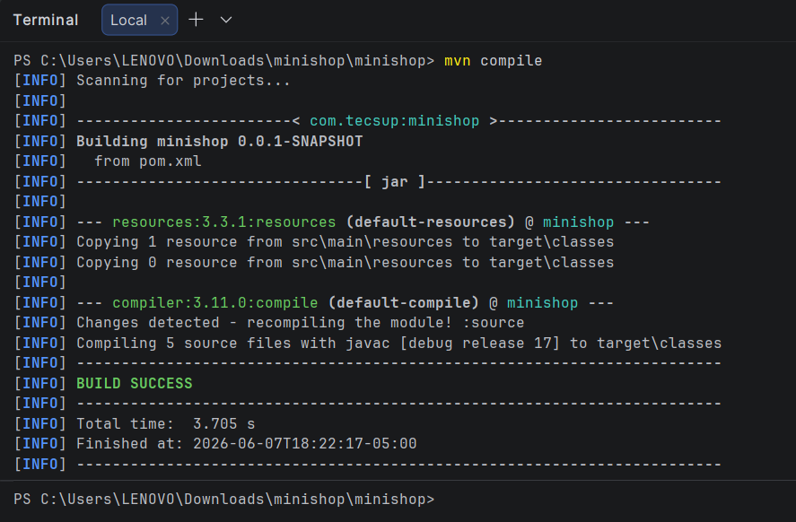
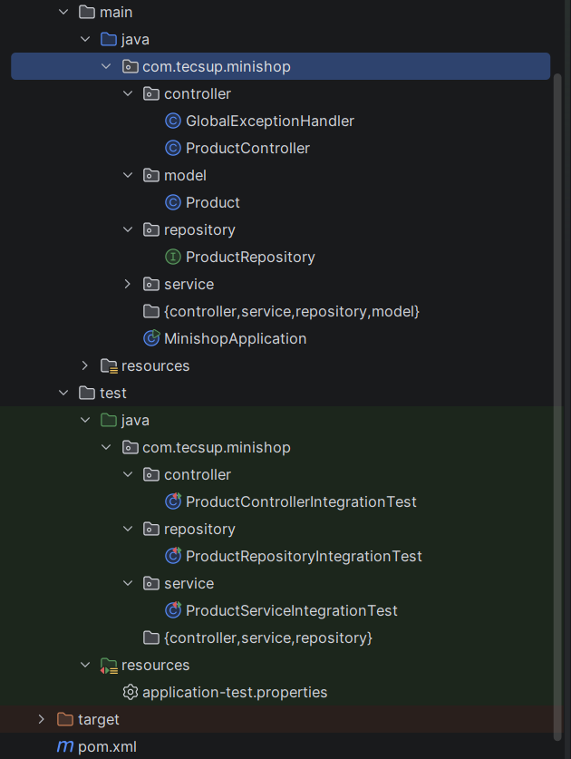
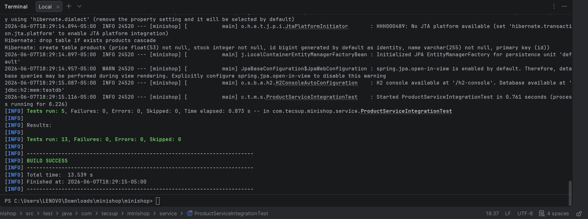

# MiniShop - Lab 12: Pruebas de Integracion

**Curso:** Construccion y Pruebas de Software - IV Ciclo  
**Alumno:** Diego Huacca Ccaso  
**Docente:** Mg. Edwin Cordova Benavente  
**Semana:** 12

---

## Descripcion

API REST para gestionar productos de una tienda, desarrollada con Spring Boot.
El objetivo es implementar pruebas de integracion en tres capas.

---

## Tecnologias

- Java 17
- Spring Boot 3.2.5
- Spring Data JPA
- H2 Database (en memoria)
- Lombok
- JUnit 5 + MockMvc + Mockito

---

## Pruebas de integracion

| Clase | Anotacion | Tests |
|---|---|---|
| ProductRepositoryIntegrationTest | @DataJpaTest | 4 |
| ProductServiceIntegrationTest | @SpringBootTest + @MockBean | 5 |
| ProductControllerIntegrationTest | @SpringBootTest + MockMvc | 4 |

---

## Resultados

### mvn compile

### Estructura del proyecto

### mvn test - 13 tests en verde

---

## Conclusiones

1. Comprendi que las pruebas de integracion complementan a las unitarias verificando los contratos entre capas.
2. Aplique @DataJpaTest para probar el repositorio de forma aislada contra H2 sin levantar el contexto completo de Spring.
3. Utilice @MockBean para verificar la logica del servicio sin depender de la base de datos real.
4. Implemente pruebas end-to-end con MockMvc desde la peticion HTTP hasta H2 y de vuelta.
5. Identifique que se necesita @RestControllerAdvice para convertir excepciones en respuestas HTTP correctas.